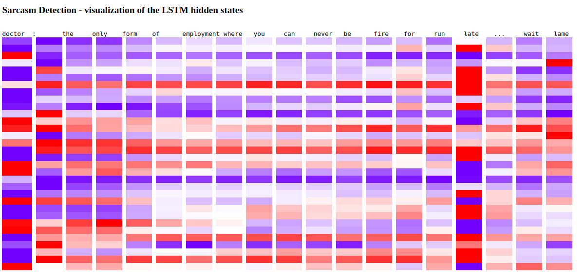
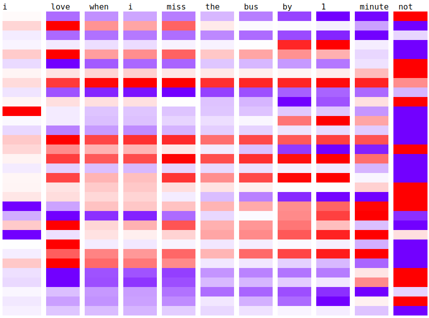
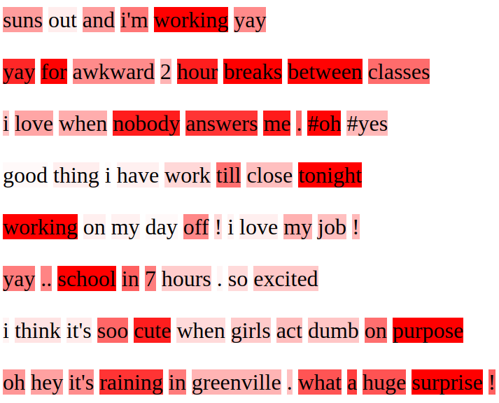

# Sarcasm-Detection

Sarcasm is a form of verbal irony that is intended to express contempt or ridicule. Relying on the shared knowledge between the speaker and his audience, sarcasm requires wit to understand and wit to produce. In our daily interactions, we use gestures and mimics, intonation and prosody to hint the sarcastic intent. Since we do not have access to such paralinguistic cues, detecting sarcasm in written text is a much harder task.

I investigated various methods to detect sarcasm in tweets, using both traditional machine learning (SVMs and Logistic Regressors on discrete features) and deep learning models (CNNs, LSTMs, GRUs, Bi-directional LSTMs and attention-based LSTMs), evaluating them on 4 different Twitter datasets (details in [res/](res)).

This research project was completed in partial fulfilment of the requirements for the degree of Bachelor of Science in Computer Science at the University of Manchester and under the careful supervision of Mr John McNaught, my tutor and mentor.

The overall project achievements are explained in this video https://www.youtube.com/watch?v=ofrn3T76dHg.

## Overview
* [src/](src) contains all the source code used to process, analyse, train and evaluate the datasets (as described in [res/](res)) in order to investigate sarcasm detection on Twitter data
* [res/](res) contains both the raw and processed datasets as well as some useful vocabularies, lists or selections of words/emojis that proved very useful in pre-processing the data
* [models/](models) contains all the pre-trained models contributing to the achievement of the claimed results as well as all the trained models, saved after training under the described parameters and DL architectures
* [plots/](plots) contains a collection of interesting plots that should be useful in analysing and sustaining the results obtained
* [stats/](stats) contains some comparisons between preprocessing phases as well as some raw statistical results collected while training/evaluating
* [images/](images) contains the visualizations obtained and some pictures of the architectures or models used in the report or screencast

## Dependencies

The code included in this repository has been tested to work with Python 3.5 on an Ubuntu 16.04 machine, using Keras 2.0.8 with Tensorflow as the backend.

#### List of requirements
* [Python](https://www.python.org/downloads/) 3.5
* [Keras](https://github.com/fchollet/keras) 2.0
* [Tensorflow](https://www.tensorflow.org/install/) 1.3
* [gensim](https://github.com/RaRe-Technologies/gensim) 3.0 
* [numpy](https://github.com/numpy/numpy) 1.13
* [scikit-learn](https://github.com/scikit-learn/scikit-learn)
* [h5py](https://github.com/h5py/h5py)
* [emoji](https://github.com/carpedm20/emoji)
* [tqdm](https://github.com/tqdm/tqdm)
* [pandas](https://github.com/pandas-dev/pandas)
* [itertools](https://pypi.python.org/pypi/more-itertools) 
* [matplotlib](https://github.com/matplotlib/matplotlib)

## Installation and running

1. Clone the repository and make sure that all the dependencies listed above are installed.
2. Download all the resources from [here](https://drive.google.com/open?id=1AcGulyTXcrsn6hStefD3M0MNrzkxV_1n) and place them in the *res/* directory
3. Download the pre-trained models from [here](https://drive.google.com/open?id=1ss9-4LEzuKC-p1s0lLa0XVu2_ERM-ynL) and place them in the *models/* directory
4. Go to the *src/* directory
5. For a thorough feature analysis, run:
```bash
python feature_analysis.py
```
6. For training and evaluating a traditional machine learning model, run:
```bash
python ml_models.py
```
7. For training and evaluating the embeddings (word and/or emojis/deepmojis), run:
```bash
python embeddings_model.py
```
8. For training and evaluating various deep learning models, quickly implemented in Keras, run:
```bash
python dl_models.py
```
9. For training and evaluating the attention-based LSTM model implemented in TensorFlow, run:
```bash
python tf_attention.py
```

By default, the dataset collected by [Ghosh and Veale (2016)](http://www.aclweb.org/anthology/W16-0425) is used, but this can be easily replaced by changing the *dataset* parameter in the code (as for all other parameters).

## Results

Here are the results obtained on the considered datasets.


## Visualizations

You can obtain a nice visualization of a deep layer by extracting the final weights and colour the hidden units distinctively. Running either of the two files below will produce a .html file in *plots/html_visualizations/*.

#### LSTM visualization  

Visualize the LSTM weights for a selected example in the test set after you have trained the model (here we use a simpler architecture with fewer hidden units and no stacked LSTMs in order to visualize anything sensible). Excitatory units (weight > 0) are coloured in a reddish colour while inhibitory units (weight < 0) in a bluish colour. Colour gradients are used to distinguish the heavy from the weak weights. Run:
```bash
python src/visualize_hidden_units.py
```

In the sample visualization given below, *doctor*, *late* and even *lame* have heavier weights and therefore are contributing more to sarcasm recognition (since they receive more attention). Historically, we know that *going to the doctor* is regarded as an undesirable activity (so it is subject to strong sarcastic remarks) while *late* and *lame* are sentiment-bearing expressions, confirming previous results about sarcastic cues in written and spoken language. 





Other visualizations are available in *images/*

#### Attention visualization

Visualize the *attention* words over the whole (or a selection of the) test set after you have trained the model. The network is paying attention to some specific words (supposedly, those who contribute more towards a sarcasm decision being made). A reddish colour is used to emphasize attention weights while colour gradients are used to distinguish the heavy from the weak weights. Run:
```bash
python src/visualize_tf_attention.py
```

In the sample visualization given below, strong sentiment-bearing words, stereotypical topics, emojis, punctuation, numerals and sometimes slang or ungrammatical words are receiving more attention from the network and therefore are contributing more to sarcasm recognition.



## Disclaimer

The purpose of this project was **not** to produce the most optimally efficient code, but to draw some useful conclusions about sarcasm detection in written text (specifically, for Twitter data). However, it is not disastrously inefficient - actually, it should be fast enough for most purposes. Although the code has been verified and reviewed, I cannot guarantee that there are absolutely no bugs or faults so use the code on your own responsibility.

## License

The source code and all my pre-trained models are licensed under the MIT license.

## References

[[1]](http://www.cs.utah.edu/~riloff/pdfs/official-emnlp13-sarcasm.pdf) Ellen Riloff, Ashequl Qadir, Prafulla Surve, Lalindra De Silva, Nathan Gilbert, and Ruihong Huang. 2013. Sarcasm as contrast between a positive sentiment and negative situation. In EMNLP, volume 13, pages 704–714.

[[2]](http://www.aclweb.org/anthology/W16-0425) Aniruddha Ghosh and Tony Veale. 2016. Fracking Sarcasm using Neural Network. 7th Workshop on Computational Approaches to Subjectivity, Sentiment and Social Media Analysis (WASSA 2016). NAACL-HLT.

[[3]](https://pdfs.semanticscholar.org/0c27/64756299a82659605b132aef9159f61a4171.pdf) Tomas Ptacek, Ivan Habernal, and Jun Hong. 2014. Sarcasm detection on Czech and English Twitter. In COLING, pages 213–223.

[[4]](https://arxiv.org/pdf/1301.3781.pdf) Tomas Mikolov, Kai Chen, Greg Corrado, and Jeffrey Dean. 2013. Efficient estimation of word representations in vector space. arXiv preprint arXiv:1301.3781.

[[5]](http://nlp.stanford.edu/pubs/glove.pdf) Jeffrey Pennington, Richard Socher, and Christopher D. Manning. "GloVe: Global Vectors for Word Representation," in Proceedings of the 2014 Conference on Empirical Methods In Natural Language Processing (EMNLP 2014), October 2014.

[[6]](https://arxiv.org/abs/1609.08359) Ben Eisner, Tim Rocktäschel, Isabelle Augenstein, Matko Bošnjak, and Sebastian Riedel. “emoji2vec: Learning Emoji Representations from their Description,” in Proceedings of the 4th International Workshop on Natural Language Processing for Social Media at EMNLP 2016 (SocialNLP at EMNLP 2016), November 2016.

[[7]](http://www.bioinf.jku.at/publications/older/2604.pdf) Sepp Hochreiter and Jurgen Schmidhuber. Long short-term memory. 1997. In Neural Computation 9(8):1735-80.

[[8]](https://arxiv.org/pdf/1409.0473.pdf) Dzmitry Bahdanau, KyungHyun Cho and Yoshua Bengio. 2016. Neural Machine Translation by Jointly Learning to Align and Translate. arXiv:1409.0473v7
